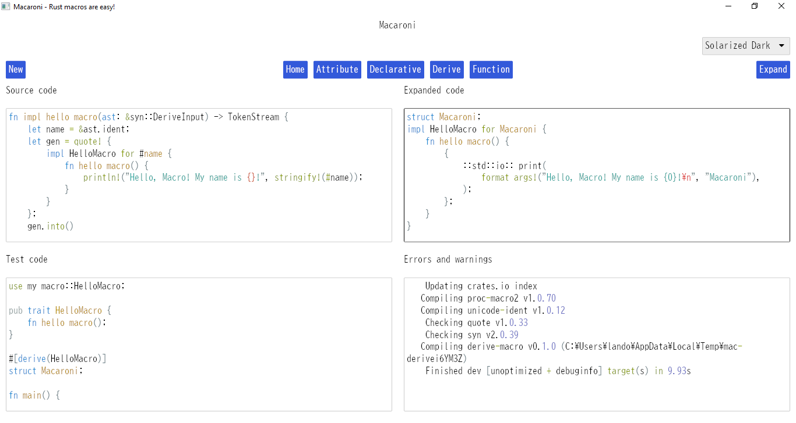

# Macaroni
## Making Rust macros easy

Macaroni was inspired by my desire to learn to write my own Rust proc-macros, get a taste for writing a GUI
application, and make something other Rustaceans might like. In my time learning and designing Macaroni, I
tried Dioxus, egui, and Iced, and even looked at web frameworks and Tauri, exploring all of my
options for creating a user-friendly (and developer-friendly) interface. Actually writing Rust macros when all the setup
is taken care of is far less daunting than it feels coming in as a newb.
Writing Rust macros is easy!

This is still very much a work in progress since this is the fourth or fifth time
I am starting over with a new GUI library.
I eventually settled on Iced because the state management and
sharing is straight-forward, I like the view/update design and message-passing paradigm, and recently support
was added for a text editor with syntax highlighting.

## TODO

The bar for this project is extremely low. I am a first-time GUI developer, and I have only one goal
for Macaroni which is to have the application set up a Cargo project with the correct template and
compile and expand the macros as I am working on them.

- [x] Write an attribute macro, compile, and expand it
- [x] Write a declarative macro, and expand it
- [x] Write a derive macro, compile, and expand it
- [x] Write a function-like macro, compile, and expand it
- [x] Remove extra line breaks caused by Windows
- [x] Keep the tab buttons centered
- [ ] Insert spaces when tab is pressed
- [ ] Create a custom Macaroni theme
- [ ] Make app theme switcher
- [ ] See Cargo.toml
- [ ] Edit Cargo.toml
- [ ] Show macro compile errors
- [ ] Show learning resources in Home tab
- [ ] Get terminal window to not show up when expanding
- [ ] Import font that has visible underscores? Figure out why
      underscores are invisible.
- [ ] Expand macros with a keyboard shortcut
- [ ] Make Home tab pretty (with hyperlinks)

## Development

I'm working on this on my own time. I welcome conversation with anyone who wants to learn more about Rust
and Rust macros. I'll take suggestions, but this is a small project, not really a huge open-source endeavor.
Would I like for this to be good enough that people want to use it? Absolutely, which is why I will consider
your input. You are also more than welcome to fork this repository and develop your own Macaroni recipe.

## Use

Until I figure out what bundler I can use with Iced to make Macaroni into a proper desktop app, your best bet is
to compile from source on your machine. To do this on Windows, as I have learned,
you will need Visual Studio Build Tools installed because wgpu depends on them (I think)?
